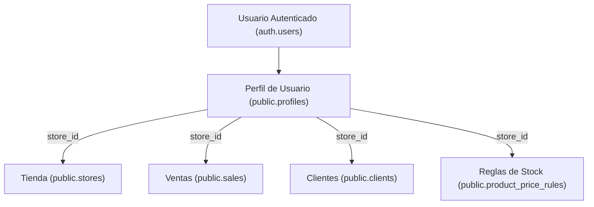
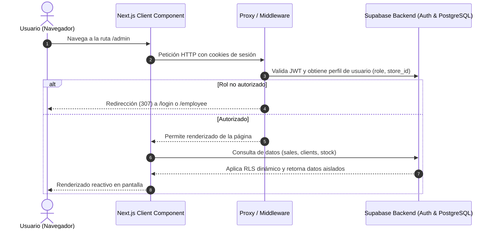

# 🏗️ Arquitectura del Sistema

Este documento describe el diseño arquitectónico de **ERP Tiendas**, detallando el modelo multi-inquilino (*multi-tenant*), la capa de seguridad, la gestión de estado y la integración de Next.js 16 con Supabase.

---

## 🏬 Modelo Multi-Tenant (Multi-Inquilino)

El sistema utiliza un esquema de **Aislamiento Logico en Base de Datos Unificada** mediante PostgreSQL Row Level Security (RLS). 

### Principios Clave:
1. **Identificador Único de Tienda (`store_id`)**: Cada registro en las tablas operativas (`profiles`, `clients`, `sales`, `product_price_rules`) contiene una clave foránea `store_id` que referencia a `public.stores`.
2. **Evaluación Transparente**: La función SQL `get_current_user_store_id()` resuelve dinámicamente la tienda del usuario conectado a partir de `auth.uid()`.
3. **Filtro Automático en RLS**: Las consultas desde el cliente no requieren adjuntar manualmente condiciones `WHERE store_id = ...` para seguridad; la base de datos rechaza o filtra automáticamente cualquier fila que no pertenezca a la tienda del perfil autenticado.

---

## 🔒 Control de Acceso Centralizado (`src/proxy.ts`)

La protección de rutas se gestiona centralizadamente en `src/proxy.ts` (invocado por el middleware de Next.js):

- **`/login`**: Acceso libre para usuarios no autenticados. Si un usuario con sesión iniciada entra a `/login`, se redirige automáticamente al panel según su rol.
- **`/admin/*`**: Exclusivo para el rol `admin`. Si un usuario con rol `employee` intenta ingresar, se redirige a `/employee`.
- **`/employee/*`**: Permitido para roles `admin` y `employee`.
- **`/superadmin/*`**: Exclusivo para el rol `superadmin` (control global de altas de comercios).
- **`/` (Raíz)**: Redirección inteligente al panel correspondiente tras evaluar el rol del usuario (`/admin`, `/employee`, o `/superadmin`).

---

## 🔄 Flujo de Datos e Interacción

---

## 🧩 Patrones de Componentes (React 19 & Next.js 16)

- **Pureza y Optimización**: Se aplican las reglas estrictas de React 19 (React Compiler). Los efectos secundarios (`setState`, cálculos de tiempo) se extraen de la fase de render para garantizar renderizados puros y libres de re-renderizados en cascada.
- **Carga de Datos Asíncrona**: Uso del patrón de montaje seguro con banderas de cancelación (`ignore`) para prevenir *race conditions* en llamadas asíncronas de Supabase.
- **Transiciones y Feedback**: Uso de toasts responsivos (`useToast`), skeletoms de carga (`Skeleton`) y modales optimizados (`Dialog`).
