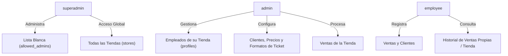

# 🔑 Autenticación y Control de Roles

**ERP Tiendas** utiliza Supabase Auth integrado con Google OAuth 2.0 para ofrecer una experiencia de inicio de sesión sin contraseñas, respaldada por un estricto control de acceso basado en roles (RBAC).

---

## 👥 Jerarquía de Roles

### 1. `superadmin`
- **Ámbito**: Global / Plataforma.
- **Responsabilidades**: Pre-autorizar la creación de nuevas tiendas mediante la adición de correos electrónicos y nombres de tienda a la tabla `allowed_admins`. Puede visualizar y gestionar cualquier tienda del sistema.
- **Ruta de Acceso**: `/superadmin`.

### 2. `admin` (Administrador de Tienda)
- **Ámbito**: Tienda propia (`store_id`).
- **Responsabilidades**:
  - Pre-registrar y administrar perfiles de empleados (`preload_employee`, `update_employee_user`, `delete_employee_user`).
  - Configurar reglas de precio especial por cantidad (Stock).
  - Ajustar preferencias de la tienda (p. ej. ancho de impresión de tickets: 58mm o 80mm).
  - Visualizar métricas financieras, KPI de ingresos y reportes detallados por empleado.
- **Ruta de Acceso**: `/admin` (también puede acceder a `/employee`).

### 3. `employee` (Empleado)
- **Ámbito**: Tienda propia (`store_id`).
- **Responsabilidades**:
  - Registrar ventas diarias mediante formulario rápido o venta agrupada (Efectivo, Transferencia, Tarjeta).
  - Emitir e imprimir comprobantes térmicos.
  - Registrar nuevos clientes en el directorio.
- **Ruta de Acceso**: `/employee`. Si intenta ingresar a `/admin`, el proxy lo redirige automáticamente a `/employee`.

---

## 🔄 Flujos de Registro e Início de Sesión

### A. Inicio de Sesión mediante Google OAuth
1. El usuario hace clic en *"Iniciar sesión con Google"* en `/login`.
2. Supabase Auth redirige al proveedor de identidad de Google.
3. Al autenticarse, Google retorna al endpoint de callback de la aplicación `/auth/callback`.
4. La ruta `/auth/callback` intercambia el código por la sesión de Supabase y redirige a la raíz `/`, donde `proxy.ts` enruta al usuario según su rol en `profiles`.

### B. Pre-carga de Empleados por el Administrador (`preload_employee`)
Para permitir que un empleado acceda directamente con su cuenta de Google a una tienda existente:
1. El Administrador ingresa a `/admin` -> *Gestión de Personal*.
2. Ingresa el nombre y correo Gmail del empleado.
3. El sistema llama a la función PL/pgSQL `preload_employee()`, la cual crea un perfil temporal en `profiles` asociado al `store_id` del administrador.
4. Cuando el empleado inicia sesión con Google por primera vez, el trigger `on_auth_user_created` detecta el correo pre-cargado, vincula su UUID real de `auth.users` y le concede acceso inmediato con su tienda y rol asignado.

### C. Registro de Nuevas Tiendas mediante Lista Blanca
Para prevenir el registro no autorizado de tiendas:
1. El `superadmin` añade el correo del nuevo dueño y el nombre de la tienda a la lista blanca (`allowed_admins`).
2. El nuevo dueño inicia sesión con Google.
3. El trigger `on_auth_user_created` valida la presencia del correo en `allowed_admins`, crea la tienda en `stores`, crea el perfil `admin` y remueve la autorización consumida de la lista blanca.
4. Si un correo no autorizado intenta ingresar, el trigger aborta la transacción y muestra una alerta de acceso denegado.
