# 🔑 Autenticación y Control de Roles

**ERP Tiendas** utiliza Supabase Auth integrado con Google OAuth 2.0 para ofrecer una experiencia de inicio de sesión sin contraseñas, respaldada por un estricto control de acceso basado en roles (RBAC).

---

## 👥 Jerarquía de Roles

```mermaid
graph TD
    SA["superadmin"] -->|Administra| W["Lista Blanca (allowed_admins)"]
    SA -->|Acceso Global| S["Todas las Tiendas (stores)"]
    
    A["admin"] -->|Gestiona| P["Personal de su Tienda (profiles)"]
    A -->|Configura| C["Sucursales, Clientes, Catálogo, Precios y Ajustes"]
    A -->|Acceso Global Tienda| V1["Ventas y Stock de Todas las Sucursales"]
    
    ENC["encargado"] -->|Gestiona| P2["Caja y Stock de su Sucursal"]
    ENC -->|Edita| C2["Catálogo, Precios y Clientes de la Tienda"]
    ENC -->|Opera| V2["Ventas y Ajustes de Stock de su Sucursal"]
    
    CAJA["caja / employee"] -->|Registra / Corrige| V3["Ventas Propias / Clientes (Sucursal)"]
    STOCK["stock"] -->|Ajusta| ST["Inventario / Stock de su Sucursal"]
```

### 1. `superadmin`
- **Ámbito**: Global / Plataforma.
- **Responsabilidades**: Pre-autorizar la creación de nuevas tiendas mediante la adición de correos electrónicos y nombres de tienda a la tabla `allowed_admins`. Puede visualizar y gestionar cualquier tienda del sistema.
- **Ruta de Acceso**: `/superadmin`.

### 2. `admin` (Administrador de Tienda)
- **Ámbito**: Tienda propia (`store_id`), sin restricción de sucursal — flota sobre todas las sucursales de su tienda (`branch_id` siempre `NULL`).
- **Responsabilidades**:
  - Pre-registrar y administrar perfiles (`admin`, `encargado`, `caja`, `stock`) en cualquier sucursal de su tienda (`preload_employee`, `update_employee_user`, `delete_employee_user`).
  - Crear, renombrar y desactivar sucursales (`branches`) desde el panel.
  - Configurar catálogo, categorías, reglas de precio y preferencias de la tienda.
  - Visualizar métricas financieras, KPI de ingresos y reportes globales de todas las sucursales.
- **Ruta de Acceso**: `/admin` (también puede acceder a `/employee`).

### 3. `encargado` (Encargado de Sucursal)
- **Ámbito**: Tienda propia (`store_id`) y una sucursal fija asignada (`branch_id`, obligatoria).
- **Responsabilidades**:
  - Pre-registrar y editar perfiles de personal de roles `caja` y `stock` exclusivamente para su propia sucursal.
  - Administrar el catálogo de productos, categorías, reglas de precio y clientes a nivel de tienda.
  - Visualizar métricas, historial de ventas y realizar ajustes de stock de su sucursal.
  - Excluido de la administración de sucursales (`BranchManager`) y configuración global de tienda (`StoreSettingsView`).
- **Ruta de Acceso**: `/encargado`.

### 4. `caja` (Punto de Venta / Cajero)
- **Ámbito**: Tienda propia (`store_id`) y una sucursal fija asignada (`branch_id`, obligatoria).
- **Responsabilidades**:
  - Registrar ventas diarias atribuidas a su sucursal; emitir e imprimir tickets.
  - Crear nuevos clientes en el directorio durante la venta.
  - Consultar, editar o anular sus propias ventas del día actual (`created_at >= medianoche local`, `employee_id = auth.uid()`) en su sucursal.
  - Lectura de productos y stock de su sucursal; sin permisos de escritura sobre catálogo ni sobre ventas de otros empleados.
- **Ruta de Acceso**: `/employee` (sección `Nueva venta` y `Mis ventas`).

### 5. `stock` (Encargado de Inventario / Bodega)
- **Ámbito**: Tienda propia (`store_id`) y una sucursal fija asignada (`branch_id`, obligatoria).
- **Responsabilidades**:
  - Consultar inventario y registrar ajustes de stock (`adjust_branch_stock`) para su sucursal asignada.
  - Lectura de productos y movimientos de su sucursal; sin permisos de registro de ventas ni modificación de catálogo.
- **Ruta de Acceso**: `/employee` (sección de ajuste de stock).

### 6. `employee` (Rol Legado)
- **Ámbito**: Equivalente a `caja` en todos los accesos y políticas de RLS. Valor conservado para compatibilidad con perfiles existentes; no disponible para nuevas asignaciones ni invitaciones.

---

### 📋 Matriz de Asignación de Roles

| Quien invita / edita | Roles que puede asignar | Restricción de Sucursal |
| :--- | :--- | :--- |
| `superadmin` | Cualquier rol | Global |
| `admin` | `admin`, `encargado`, `caja`, `stock` | Cualquier sucursal de su tienda |
| `encargado` | `caja`, `stock` | **Únicamente su propia sucursal** |
| `caja` / `stock` / `employee` | Ninguno | — |

---

### 🛡️ Matriz Rol / Sucursal / Rutas

| Rol | `branch_id` | Ruta Principal | Rutas Permitidas |
| :--- | :--- | :--- | :--- |
| `superadmin` | `NULL` | `/superadmin` | `/superadmin` |
| `admin` | `NULL` | `/admin` | `/admin`, `/employee` |
| `encargado` | Obligatorio | `/encargado` | `/encargado` |
| `caja` / `employee` | Obligatorio | `/employee` | `/employee` (Caja POS) |
| `stock` | Obligatorio | `/employee` | `/employee` (Stock) |

---

## 🔄 Flujos de Registro e Início de Sesión

### A. Inicio de Sesión mediante Google OAuth
1. El usuario hace clic en *"Iniciar sesión con Google"* en `/login`.
2. Supabase Auth redirige al proveedor de identidad de Google.
3. Al autenticarse, Google retorna al endpoint de callback de la aplicación `/auth/callback`.
4. La ruta `/auth/callback` intercambia el código por la sesión de Supabase y redirige a la raíz `/`, donde `proxy.ts` enruta al usuario según su rol (`homeFor(role)`).

### B. Pre-carga de Personal (`preload_employee`)
Para permitir que un miembro del equipo acceda con su cuenta de Google a una tienda existente:
1. El Administrador o Encargado ingresa a *Gestión de Personal*.
2. Ingresa el nombre, correo Gmail y selecciona el rol y la sucursal (para roles que la requieren).
3. El sistema llama a `preload_employee()`, validando la matriz de asignación y coherencia de sucursal.
4. Cuando el usuario inicia sesión con Google por primera vez, el trigger `on_auth_user_created` vincula su UUID real de `auth.users` y le concede acceso con su rol y sucursal asignados.

### C. Prevención de Escalación de Privilegios
Las políticas RLS sobre `profiles` imponen validación estricta en `WITH CHECK` (mediante `CASE public.get_current_user_role()`):
- Los encargados solo pueden modificar perfiles `caja`/`stock`/`employee` de su propia sucursal.
- Se removió la cláusula de auto-modificación (`id = auth.uid()`), evitando que cualquier usuario pueda auto-promoverse de rol vía consultas directas a Supabase.

