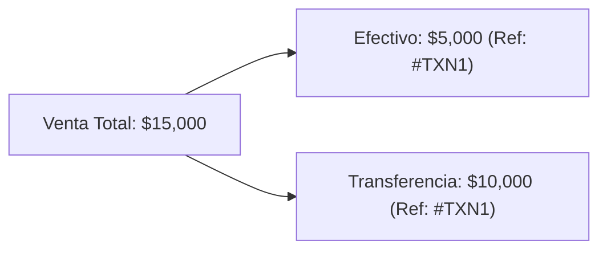

# ✨ Funcionalidades y Módulos del Sistema

Este documento describe las capacidades funcionales de **ERP Tiendas** y el comportamiento de cada módulo de la plataforma.

---

## 🛒 1. Formulario de Ventas y Pagos Combinados

El módulo de registro de ventas (`sales-form.tsx` y `SaleModal.tsx`) permite procesar operaciones comerciales de forma ágil e intuitiva.

### Características Principales:
- **Carga de Ítems Múltiples**: Adición dinámica de productos con cálculo bidireccional entre *Cantidad*, *Precio Unitario* e *Importe Total*.
- **Desglose de Pago Combinado**: Soporte para operaciones pagadas con múltiples medios (ej. parte en Efectivo y parte por Transferencia/Tarjeta).
- **Código de Referencia Único (`ref_code`)**: Cuando una venta es combinada o incluye múltiples comprobantes, el sistema asigna una referencia compartida para agrupar las transacciones sin perder el desglose por medio de pago en la base de datos.
- **Asociación de Cliente**: Posibilidad de ingresar o buscar un cliente por su nombre/teléfono para vincular la venta en el directorio.

---

## 🖨️ 2. Generación e Impresión de Comprobantes (Tickets)

El componente `ReceiptModal.tsx` se encarga de renderizar e imprimir los comprobantes de venta.

### Características:
- **Formatos Térmicos Configurables**: Compatible con impresoras térmicas de posnet de **58mm** o **80mm** (configurado en los ajustes de la tienda).
- **Exportación en PDF**: Integración nativa con `jsPDF` (`pdfGenerator.ts`) para descargar comprobantes o reportes consolidados en PDF con formato profesional.
- **Detalle Estructurado**: Incluye encabezado de la tienda, código de referencia, vendedor, detalle de ítems, totales, desglose de pago y datos del cliente.

---

## 📦 3. Catálogo de Productos y Stock por Sucursal (Stock Phase 2)

`StockView.tsx` tiene dos pestañas: **Productos** (catálogo + stock, esta sección) y **Precios Especiales** (sección 3.4, sin cambios de comportamiento).

### Catálogo de productos
- Alta/edición de productos: nombre, categoría (seleccionable o creable en el momento), precio de costo y precio de venta. **El código de barras nunca se escribe a mano** — se genera automáticamente al guardar (ver `docs/database.md`, "Generación de código EAN-8") y se muestra de solo lectura al editar.
- Desactivación lógica (no se borra el producto ni su historial de ventas/movimientos).

### Stock por sucursal
- La columna **Stock** muestra `branch_stock.current_stock` para la sucursal seleccionada en el encabezado (`selectedBranchId`); cambia inmediatamente si el admin cambia de sucursal.
- **Ajustar Stock**: diálogo admin-only que llama al RPC `adjust_branch_stock` (motivo: ajuste manual o reposición). Empleados no tienen esta acción disponible y el RPC la rechaza igualmente a nivel de base de datos si se invocara de otra forma.
- **Historial de Movimientos**: diálogo de solo lectura por producto y sucursal, listando cada venta, reversión, ajuste o ingreso por importación con su delta aplicado y el saldo resultante.

### Etiquetas de producto (`ProductLabel.tsx`)
- Genera un gráfico de código de barras **EAN-8** (librería `jsbarcode`) junto con el código en texto, el nombre y el precio de venta del producto.
- Impresión individual (acción por fila) o por lote (selección múltiple + "Imprimir seleccionados", o "Imprimir importados" tras correr una importación) — un solo trabajo de impresión con una etiqueta por producto, siguiendo el mismo patrón `window.open` + HTML autocontenido que `ReceiptModal.tsx` (no el bloque `@media print` sin uso de `globals.css`).
- Sin punto de entrada bajo `/employee/*`: solo accesible desde el panel de administración.

### Importación y exportación de catálogo (Excel)
- **Importar** (`ProductImportDialog.tsx`): sube un `.xlsx` con columnas `ID` (opcional), `Nombre del Producto`, `Sección`, `Cantidad Ingresada`, `Precio Costo Unitario`, `Precio Venta Unitario`. Las columnas `Margen%`/`Totales` nunca se leen, ni siquiera si contienen un error de fórmula (`#VALUE!`).
  - Una fila con `ID` vacío o que no coincide con ningún `barcode` existente en la tienda **siempre crea un producto nuevo** con un código EAN-8 recién generado — el valor del archivo nunca se adopta como código real.
  - Una fila con `ID` coincidente actualiza nombre/categoría/precios del producto existente y **suma** la cantidad indicada al stock de la sucursal de destino (nunca la sobrescribe).
  - Antes de confirmar, se muestra un resumen: productos a crear, a actualizar y categorías nuevas a crear; el commit real produce exactamente esos números.
  - El commit corre en 4 pasos: crear categorías nuevas → crear productos nuevos (código generado por la base) → actualizar productos existentes → un RPC `adjust_branch_stock` por cada fila con cantidad. El último paso es individualmente falible por diseño (es aditivo, no se revierte el resto); el diálogo reporta qué filas fallaron.
- **Exportar** (`ProductExportButton.tsx`): genera un `.xlsx` del catálogo activo con las mismas columnas y el mismo orden que la importación (usando la cantidad actual en la sucursal seleccionada), de forma que el archivo exportado se pueda volver a importar sin modificaciones y actualice cada fila sin crear duplicados.
- Ambas acciones son exclusivas del panel de administración.

---

## 🏷️ 3.4. Reglas de Precio Especial por Cantidad

Pestaña **Precios Especiales** de `StockView.tsx` — comportamiento sin cambios desde su versión original.

### Funcionamiento:
- **Definición de Regla**: Asigna a un producto (ej. *"Remera"*) una cantidad clave (ej. `12`) con un precio especial paquete (ej. `$50,000`) frente al precio unitario individual (ej. `$5,000`).
- **Autocompletado en Formulario**: Al registrar una venta, el formulario detecta automáticamente si la cantidad ingresada alcanza una regla promocional activa y ajusta los valores unitarios.

---

## 👤 4. Directorio de Clientes (`ClientManager.tsx`)

Permite a los comercios mantener un registro ordenado de sus compradores habituales.
- **Campos**: Nombre Completo y Número Telefónico.
- **Búsqueda en Tiempo Real**: Filtrado dinámico por nombre o teléfono.
- **Operaciones Optimistas**: Actualizaciones de interfaz inmediatas (*optimistic updates*) con sincronización de fondo en Supabase.

---

## 📊 5. Panel de Control y Reportes de Administración

La vista principal de administración (`DashboardView.tsx`, `HistoryView.tsx`, `EmployeeReport.tsx`, `KpiCards.tsx`) proporciona métricas operativas clave:

- **Métricas KPI**: Ingresos totales del día, cantidad de operaciones, ticket promedio y comparación porcentual contra el día anterior.
- **Desglose por Medio de Pago**: Visualización instantánea de totales cobrados en Efectivo, Transferencias y Tarjetas.
- **Historial Agrupado**: Tabla interactiva con búsqueda por fechas, filtros rápidos (*Hoy*, *Ayer*, *Este Mes*) y desglose expandible de ventas combinadas.
- **Reporte por Empleado**: Estadísticas agregadas que muestran el total vendido y la cantidad de operaciones procesadas por cada miembro del personal.

---

## 👑 6. Portal de Superadministrador (`superadmin/page.tsx`)

Herramienta de nivel plataforma para la gestión de la red de tiendas:
- **Autorización de Tiendas**: Habilitación de nuevos comercios mediante el ingreso del correo del dueño en la lista blanca (`allowed_admins`).
- **Monitoreo de Comercios**: Listado de tiendas activas, estado de registro y acciones de revocación/eliminación.
