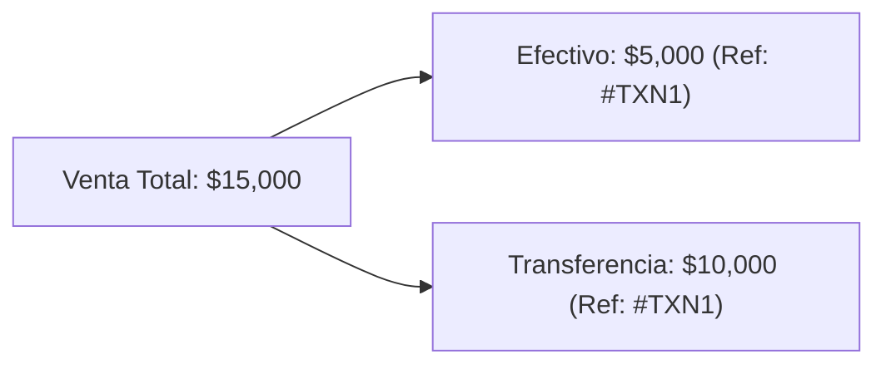

# ✨ Funcionalidades y Módulos del Sistema

Este documento describe las capacidades funcionales de **ERP Tiendas** y el comportamiento de cada módulo de la plataforma.

---

## 🛒 1. Formulario de Ventas y Pagos Combinados

El módulo de registro de ventas (`sales-form.tsx` y `SaleModal.tsx`) permite procesar operaciones comerciales de forma ágil e intuitiva.

### Características Principales:
- **Carga de Ítems Múltiples**: Adición dinámica de productos con cálculo bidireccional entre *Cantidad*, *Precio Unitario* e *Importe Total*.
- **Desglose de Pago Combinado**: Soporte para operaciones pagadas con múltiples medios (ej. parte en Efectivo y parte por Transferencia/Tarjeta).
- **Código de Referencia Único (`ref_code`)**: Cuando una venta es combinada o incluye múltiples comprobantes, el sistema asigna una referencia compartida para agrupar las transacciones sin perder el desglose por medio de pago en la base de datos.
- **Asociación de Cliente**: Posibilidad de ingresar o buscar un cliente por su nombre/teléfono para vincular la venta en el directorio.

---

## 🖨️ 2. Generación e Impresión de Comprobantes (Tickets)

El componente `ReceiptModal.tsx` se encarga de renderizar e imprimir los comprobantes de venta.

### Características:
- **Formatos Térmicos Configurables**: Compatible con impresoras térmicas de posnet de **58mm** o **80mm** (configurado en los ajustes de la tienda).
- **Exportación en PDF**: Integración nativa con `jsPDF` (`pdfGenerator.ts`) para descargar comprobantes o reportes consolidados en PDF con formato profesional.
- **Detalle Estructurado**: Incluye encabezado de la tienda, código de referencia, vendedor, detalle de ítems, totales, desglose de pago y datos del cliente.

---

## 🏷️ 3. Reglas de Precio Especial por Cantidad (Stock)

El módulo `StockView.tsx` administra las reglas de precios promocionales automáticos.

### Funcionamiento:
- **Definición de Regla**: Asigna a un producto (ej. *"Remera"*) una cantidad clave (ej. `12`) con un precio especial paquete (ej. `$50,000`) frente al precio unitario individual (ej. `$5,000`).
- **Autocompletado en Formulario**: Al registrar una venta, el formulario detecta automáticamente si la cantidad ingresada alcanza una regla promocional activa y ajusta los valores unitarios.

---

## 👤 4. Directorio de Clientes (`ClientManager.tsx`)

Permite a los comercios mantener un registro ordenado de sus compradores habituales.
- **Campos**: Nombre Completo y Número Telefónico.
- **Búsqueda en Tiempo Real**: Filtrado dinámico por nombre o teléfono.
- **Operaciones Optimistas**: Actualizaciones de interfaz inmediatas (*optimistic updates*) con sincronización de fondo en Supabase.

---

## 📊 5. Panel de Control y Reportes de Administración

La vista principal de administración (`DashboardView.tsx`, `HistoryView.tsx`, `EmployeeReport.tsx`, `KpiCards.tsx`) proporciona métricas operativas clave:

- **Métricas KPI**: Ingresos totales del día, cantidad de operaciones, ticket promedio y comparación porcentual contra el día anterior.
- **Desglose por Medio de Pago**: Visualización instantánea de totales cobrados en Efectivo, Transferencias y Tarjetas.
- **Historial Agrupado**: Tabla interactiva con búsqueda por fechas, filtros rápidos (*Hoy*, *Ayer*, *Este Mes*) y desglose expandible de ventas combinadas.
- **Reporte por Empleado**: Estadísticas agregadas que muestran el total vendido y la cantidad de operaciones procesadas por cada miembro del personal.

---

## 👑 6. Portal de Superadministrador (`superadmin/page.tsx`)

Herramienta de nivel plataforma para la gestión de la red de tiendas:
- **Autorización de Tiendas**: Habilitación de nuevos comercios mediante el ingreso del correo del dueño en la lista blanca (`allowed_admins`).
- **Monitoreo de Comercios**: Listado de tiendas activas, estado de registro y acciones de revocación/eliminación.
