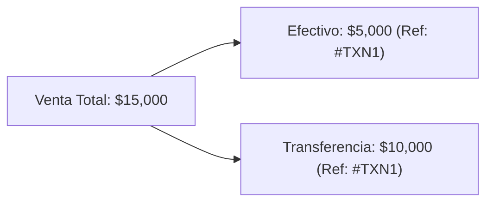

# ✨ Funcionalidades y Módulos del Sistema

Este documento describe las capacidades funcionales de **ERP Tiendas** y el comportamiento de cada módulo de la plataforma.

---

## 🛒 1. Punto de Venta (`/pos`) y Corrección de Ventas (`SaleModal.tsx`)

El registro de ventas ocurre principalmente en **`/pos`** (`src/app/pos/page.tsx` → `PosShell.tsx`), la superficie de venta usada por `caja`, `employee` y `encargado`. `SaleModal.tsx` sigue existiendo como la herramienta de **corrección/edición** de ventas ya creadas (usada por `HistoryView`/`MySalesView`), y también como una vía alternativa de alta desde el panel de administración.

### `/pos` (`PosShell.tsx`)
- **`ProductPicker`**: búsqueda de productos por nombre o código de barras, agrega ítems al carrito.
- **`BarcodeWedgeListener`**: escucha la entrada de un lector de código de barras físico (modo "wedge de teclado") en cualquier parte de la pantalla y agrega el producto encontrado sin necesidad de foco en un campo de texto; código no encontrado muestra un toast de error.
- **`PosCart`**: carrito editable en línea (cantidad/precio por fila), con soporte para reglas de precio especial por cantidad (mismo motor que `product_price_rules`, sección 3.4).
- **`StockWarningDialog`**: si la cantidad pedida excede el stock disponible en la sucursal, muestra una advertencia **no bloqueante** antes de confirmar — el usuario puede continuar y la venta se registra igual (el stock se recorta en cero, nunca queda negativo).
- **`PosSubmitPanel`**: selección de medio de pago (efectivo/transferencia/tarjeta), pago combinado con desglose por medio y referencia compartida (`Ref:`), y datos opcionales de cliente.
- Admin no tiene sucursal fija: `/pos` incluye su propio selector de sucursal en el header (igual patrón que `admin/page.tsx`); el resto de los roles usa su `profile.branch_id` fijo.

### `SaleModal.tsx` (corrección/edición)
- **Carga de Ítems Múltiples**: Adición dinámica de productos con cálculo bidireccional entre *Cantidad*, *Precio Unitario* e *Importe Total*.
- **Desglose de Pago Combinado**: Soporte para operaciones pagadas con múltiples medios (ej. parte en Efectivo y parte por Transferencia/Tarjeta).
- **Código de Referencia Único (`ref_code`)**: Cuando una venta es combinada o incluye múltiples comprobantes, el sistema asigna una referencia compartida para agrupar las transacciones sin perder el desglose por medio de pago en la base de datos.
- **Asociación de Cliente**: Posibilidad de ingresar o buscar un cliente por su nombre/teléfono para vincular la venta en el directorio.

---

## 🖨️ 2. Generación e Impresión de Comprobantes (Tickets)

El componente `ReceiptModal.tsx` se encarga de renderizar e imprimir los comprobantes de venta.

### Características:
- **Formatos Térmicos Configurables**: Compatible con impresoras térmicas de posnet de **58mm** o **80mm** (configurado en los ajustes de la tienda).
- **Exportación en PDF**: Integración nativa con `jsPDF` (`pdfGenerator.ts`) para descargar comprobantes o reportes consolidados en PDF con formato profesional.
- **Detalle Estructurado**: Incluye encabezado de la tienda, código de referencia, vendedor, detalle de ítems, totales, desglose de pago y datos del cliente.

---

## 📦 3. Catálogo de Productos y Stock por Sucursal (Stock Phase 2)

`StockView.tsx` tiene hasta tres pestañas: **Productos** (catálogo + stock, esta sección), **Precios Especiales** (sección 3.4, sin cambios de comportamiento) y **Compras** (sección 3.5, sección 23, visible solo para `admin`/`superadmin`/`encargado`).

### Catálogo de productos
- Alta/edición de productos: nombre, categoría (seleccionable o creable en el momento), precio de costo y precio de venta. **El código de barras nunca se escribe a mano** — se genera automáticamente al guardar (ver `docs/database.md`, "Generación de código EAN-8") y se muestra de solo lectura al editar.
- Desactivación lógica (no se borra el producto ni su historial de ventas/movimientos).

### Stock por sucursal
- La columna **Stock** muestra `branch_stock.current_stock` para la sucursal seleccionada en el encabezado (`selectedBranchId`); cambia inmediatamente si el admin cambia de sucursal.
- **Ajustar Stock**: diálogo admin-only que llama al RPC `adjust_branch_stock` (motivo: ajuste manual o reposición). Empleados no tienen esta acción disponible y el RPC la rechaza igualmente a nivel de base de datos si se invocara de otra forma.
- **Historial de Movimientos**: diálogo de solo lectura por producto y sucursal, listando cada venta, reversión, ajuste o ingreso por importación con su delta aplicado y el saldo resultante.

### Etiquetas de producto (`ProductLabel.tsx`)
- Genera un gráfico de código de barras **EAN-8** (librería `jsbarcode`) junto con el código en texto, el nombre y el precio de venta del producto.
- Impresión individual (acción por fila) o por lote (selección múltiple + "Imprimir seleccionados", o "Imprimir importados" tras correr una importación) — un solo trabajo de impresión con una etiqueta por producto, siguiendo el mismo patrón `window.open` + HTML autocontenido que `ReceiptModal.tsx` (no el bloque `@media print` sin uso de `globals.css`).
- Sin punto de entrada bajo `/employee/*`: solo accesible desde el panel de administración.

### Importación y exportación de catálogo (Excel)
- **Importar** (`ProductImportDialog.tsx`): sube un `.xlsx` con columnas `ID` (opcional), `Nombre del Producto`, `Sección`, `Cantidad Ingresada`, `Precio Costo Unitario`, `Precio Venta Unitario`. Las columnas `Margen%`/`Totales` nunca se leen, ni siquiera si contienen un error de fórmula (`#VALUE!`).
  - Una fila con `ID` vacío o que no coincide con ningún `barcode` existente en la tienda **siempre crea un producto nuevo** con un código EAN-8 recién generado — el valor del archivo nunca se adopta como código real.
  - Una fila con `ID` coincidente actualiza nombre/categoría/precios del producto existente y **suma** la cantidad indicada al stock de la sucursal de destino (nunca la sobrescribe).
  - Antes de confirmar, se muestra un resumen: productos a crear, a actualizar y categorías nuevas a crear; el commit real produce exactamente esos números.
  - El commit corre en 4 pasos: crear categorías nuevas → crear productos nuevos (código generado por la base) → actualizar productos existentes → un RPC `adjust_branch_stock` por cada fila con cantidad. El último paso es individualmente falible por diseño (es aditivo, no se revierte el resto); el diálogo reporta qué filas fallaron.
- **Exportar** (`ProductExportButton.tsx`): genera un `.xlsx` del catálogo activo con las mismas columnas y el mismo orden que la importación (usando la cantidad actual en la sucursal seleccionada), de forma que el archivo exportado se pueda volver a importar sin modificaciones y actualice cada fila sin crear duplicados.
- Ambas acciones son exclusivas del panel de administración.

---

## 🏷️ 3.4. Reglas de Precio Especial por Cantidad

Pestaña **Precios Especiales** de `StockView.tsx` — comportamiento sin cambios desde su versión original.

### Funcionamiento:
- **Definición de Regla**: Asigna a un producto (ej. *"Remera"*) una cantidad clave (ej. `12`) con un precio especial paquete (ej. `$50,000`) frente al precio unitario individual (ej. `$5,000`).
- **Autocompletado en Formulario**: Al registrar una venta, el formulario detecta automáticamente si la cantidad ingresada alcanza una regla promocional activa y ajusta los valores unitarios.

---

## 🚚 3.5. Compras a Proveedor (`PurchaseModal.tsx`, `PurchasesHistory.tsx`) — sección 23

Tercera pestaña **Compras** de `StockView.tsx`, visible solo para `admin`, `superadmin` y `encargado` (`canRecordPurchase`, `src/lib/roles.ts`) — `caja`, `stock` y `employee` no la ven ni pueden operarla, ni siquiera `stock`, que sí puede mover cantidades vía "Ajustar Stock" pero nunca registrar lo que se pagó.

### Registrar una compra
- Header: proveedor (texto libre, opcional, sin tabla de proveedores), fecha y nota opcional.
- Líneas repetibles: producto (elegido del catálogo existente — **no** existe la opción "producto no listado" que sí tiene `/pos`, porque `purchase_items.product_id` es obligatorio), cantidad y costo unitario (se autocompleta con el costo actual del producto al elegirlo, editable).
- Al guardar: sube `branch_stock` de la sucursal de la compra por cada línea, escribe un `stock_movements` por línea con `reason='purchase'`, y mueve `products.purchase_price` al `unit_cost` de cada línea — **siempre que esa compra sea la más nueva registrada para ese producto** (comparando fecha de compra y luego fecha de creación); editar una compra vieja nunca pisa un costo más nuevo.

### Editar una compra
Igual que `SaleModal.tsx`: **no existe un `UPDATE` real**. Editar borra la compra completa (header + líneas, por cascada) y la vuelve a crear con los datos corregidos (id nuevo). El borrado revierte automáticamente el stock y no toca `products.purchase_price` — el alta que sigue sí lo mueve, con el mismo criterio de "más nueva" de arriba. Antes de re-crear, se verifica que la cantidad de filas realmente borradas coincida con la esperada (`deletePurchaseGroup`, `src/lib/purchasesHelper.ts`, mismo contrato que `deleteSaleGroup`); si un `encargado` intenta editar una compra de otra sucursal, el borrado no afecta filas y la operación se aborta sin re-crear nada, en vez de duplicar la compra.

### Anular una compra
Solo borra (sin re-crear): revierte el stock ingresado vía `stock_movements` con `reason='purchase_reversal'` y **nunca modifica** `products.purchase_price`, aunque la compra anulada haya sido la que fijó el costo actual — corregir el costo después de anular una compra requiere una nueva compra o una edición directa del catálogo. Misma verificación de cantidad de filas borradas que en la edición, con un mensaje de denegación en vez de un falso éxito.

### Historial (`PurchasesHistory.tsx`)
Mismo patrón de `SalesHistory.tsx`: filtro de rango de fechas con atajos ("Hoy", "Últimos 7 días", "Últimos 30 días", "Este mes"), tarjetas de resumen (total gastado, cantidad de compras, promedio) y listado ordenado por fecha, más reciente primero. Cada fila tiene acciones de editar y anular, visibles solo si `canRecordPurchase` lo permite para la sucursal de esa compra puntual (un `encargado` no ve las acciones sobre compras de otra sucursal).

### Historial de Movimientos y Ajuste de Stock
Las secciones **Historial de Movimientos** y **Ajuste de Stock** (3. arriba) ya muestran las razones `'purchase'`/`'purchase_reversal'` con las etiquetas "Compra"/"Reversión de compra" — no aparecen como texto crudo.

---

## 👤 4. Directorio de Clientes (`ClientManager.tsx`)

Permite a los comercios mantener un registro ordenado de sus compradores habituales.
- **Campos**: Nombre Completo y Número Telefónico.
- **Búsqueda en Tiempo Real**: Filtrado dinámico por nombre o teléfono.
- **Operaciones Optimistas**: Actualizaciones de interfaz inmediatas (*optimistic updates*) con sincronización de fondo en Supabase.

---

## 📊 5. Panel de Control y Reportes de Administración

La vista principal de administración (`DashboardView.tsx`, `HistoryView.tsx`, `EmployeeReport.tsx`, `KpiCards.tsx`) proporciona métricas operativas clave:

- **Métricas KPI** (`KpiCards.tsx`): Ingresos del día (con toggle para ocultar/mostrar el monto) y cantidad de ventas del día, con el ticket promedio (ingresos ÷ cantidad de ventas) mostrado dentro de la tarjeta de ventas.
- **Historial Agrupado**: Tabla interactiva con búsqueda por fechas, filtros rápidos (*Hoy*, *Ayer*, *Este Mes*) y desglose expandible de ventas combinadas.
- **Reporte por Empleado**: Estadísticas agregadas que muestran el total vendido y la cantidad de operaciones procesadas por cada miembro del personal.

---

## 📈 5.0. Analítica de Tienda (`/analytics`)

Panel de analítica (`AnalyticsShell.tsx` y sus paneles) para decisiones de negocio a nivel de producto, sucursal y stock. **Acceso exclusivo `admin` + `encargado`** — `caja`, `stock` y `employee` son redirigidos fuera de `/analytics`. Período por defecto: **últimos 30 días** (`PeriodSelector.tsx`), ajustable.

### Paneles
- **Ranking de Productos** (`ProductRankingPanel.tsx`): top de productos con alternador **Mejores/Peores** vendedores y selector de métrica (Unidades, Ingresos o Margen).
- **Comparación de Sucursales** (`BranchComparisonPanel.tsx`): ingresos, cantidad de ventas y stock total por sucursal — solo visible con datos reales para `admin` (`encargado` ve únicamente su propia sucursal, reflejo directo del scoping en `analytics_branch_comparison`).
- **Alertas de Stock Bajo** (`LowStockPanel.tsx`): productos con `branch_stock.current_stock <= branch_stock.min_stock` (ver `docs/database.md`, `min_stock` default `8`), con columna de sucursal cuando el admin ve "todas las sucursales".
- **Tendencia de Ventas** (`SalesTrendPanel.tsx`): ingresos diarios en el período seleccionado.
- **Comparación por Categoría** (`CategoryComparisonPanel.tsx`): ingresos y unidades vendidas agrupados por categoría de producto.

### Filtros y exportación
- **Selector de sucursal**: `admin` puede ver "todas las sucursales" o filtrar por una específica; `encargado` queda fijo en la propia (el filtro visual es solo informativo — el scoping real ya lo garantizan las funciones SQL, ver `docs/database.md`).
- **Actualizar**: recarga los cinco paneles con el período/sucursal actualmente seleccionados; no hay actualización en tiempo real (sin realtime push).
- **Exportar PDF** (`generateAnalyticsReportPdf`, `pdfGenerator.ts`): genera un PDF con exactamente las métricas mostradas en pantalla en ese momento (mismo período, misma sucursal, mismos datos ya cargados).

---

## 💰 5.1. Caja (Sesiones de Caja) — Cash Register

Módulo de turno de caja por sucursal (`CashSessionPanel.tsx`, `CashSessionHistoryView.tsx`, sección 17 de `migration.sql`). Resuelve la pregunta que todo comercio necesita al final de un turno: *¿cuánto efectivo debería haber en la caja ahora mismo, y cuánto hay realmente?*

### Apertura y cierre
- **Un turno abierto por sucursal, garantizado por la base de datos** (no por convención de UI) mediante un índice único parcial. Un segundo intento de apertura concurrente en la misma sucursal se rechaza y la UI muestra "ya hay una sesión abierta en esta sucursal".
- **Abrir**: solicita el `opening_amount` (fondo inicial). Disponible para `admin`/`superadmin` en cualquier sucursal de su tienda, y para `encargado`/`caja`/`employee` únicamente en la propia.
- **Cerrar**: solicita el `counted_amount` (efectivo contado físicamente) y muestra la diferencia estimada antes de confirmar. El cierre calcula y **congela permanentemente** `expected_amount` (`apertura + ventas en efectivo de la sesión + ingresos manuales − egresos manuales`) y `discrepancy` (`contado − esperado`). Una sesión cerrada **nunca se reabre** ni se recalcula, aunque después se edite una venta que perteneció a ella.
- **Continuidad de turno**: cualquier rol autorizado en la sucursal puede seguir vendiendo sobre la sesión ya abierta por otra persona — no existe un paso explícito de "entrega de turno".
- **Ninguna venta se bloquea nunca por el estado de la caja**: si no hay sesión abierta, la venta se registra igual, sin atribuir (`cash_session_id = NULL`); el panel de historial reporta ese "efectivo sin caja" para que el hueco sea visible en vez de invisible.

### Movimientos manuales (`cash_movements`)
- Ingresos/egresos manuales de efectivo (ej. pago a un proveedor, vuelto agregado) con `type`, `amount`, `reason` obligatorio y `note` opcional. **Nunca duplica el efectivo de una venta** — el efectivo de ventas se deriva, no se copia.
- Ledger de solo-inserción: ningún rol, ni siquiera quien creó el movimiento, puede editarlo o eliminarlo después.
- Un movimiento insertado luego de cerrada su sesión es válido y esperado — es la **vía de corrección recomendada** tras el cierre: en vez de reabrir o editar la venta original, se registra un `cash_out`/`cash_in` explicado en `note`. El historial marca estos movimientos como "post-cierre".

### Bloqueo de edición post-cierre
Desde que una sesión se cierra, sus ventas y líneas dejan de poder editarse/eliminarse por `encargado`/`caja`/`employee` (enforced a nivel de base de datos, ver `docs/database.md` sección 17.8). Intentarlo desde `SaleModal.tsx` (edición admin) o `MySalesView.tsx` (anulación de empleado) no falla con un error genérico: la operación de borrado devuelve cuántas filas afectó realmente, y si el número es menor al esperado la UI aborta la operación completa (no re-crea la venta) y muestra un mensaje claro en vez de arriesgar una venta duplicada con descuento de stock doble. `admin`/`superadmin` están exentos de este bloqueo.

### Historial y reconciliación (`CashSessionHistoryView.tsx`)
- Lista de sesiones (abiertas y cerradas) con apertura, cierre, montos contado/esperado y la diferencia resaltada (verde si sobra, rojo si falta).
- Movimientos expandibles por sesión, con los post-cierre señalados aparte.
- `admin`/`superadmin` ven el historial de toda la tienda (con selector de sucursal); `encargado`/`caja` solo el de su propia sucursal, en modo solo lectura.
- Contador de "efectivo sin caja" (ventas en efectivo del día con `cash_session_id IS NULL`) para detectar turnos operados sin abrir sesión.

### Ubicación en la interfaz
- Panel de administración/encargado: nueva sección **"Caja"** en el menú lateral, junto a Stock/Precios — ligada a la sucursal actualmente seleccionada (el mismo selector que ya usan Dashboard/Historial/Stock), no a un control nuevo en el encabezado.
- Empleado (`employee-dashboard.tsx`): el panel de sesión se muestra siempre visible arriba de las pestañas (es contexto, no una pestaña más), y una tercera pestaña "Caja" muestra el historial de la propia sucursal.
- `SaleModal.tsx` (alta/edición de venta desde administración) solo muestra una línea de solo lectura indicando a qué sesión se atribuirá la venta — el control de apertura/cierre vive exclusivamente en el panel de Caja.

---

## 👑 6. Portal de Superadministrador (`superadmin/page.tsx`)

Herramienta de nivel plataforma para la gestión de la red de tiendas:
- **Autorización de Tiendas**: Habilitación de nuevos comercios mediante el ingreso del correo del dueño en la lista blanca (`allowed_admins`).
- **Monitoreo de Comercios**: Listado de tiendas activas, estado de registro y acciones de revocación/eliminación.
